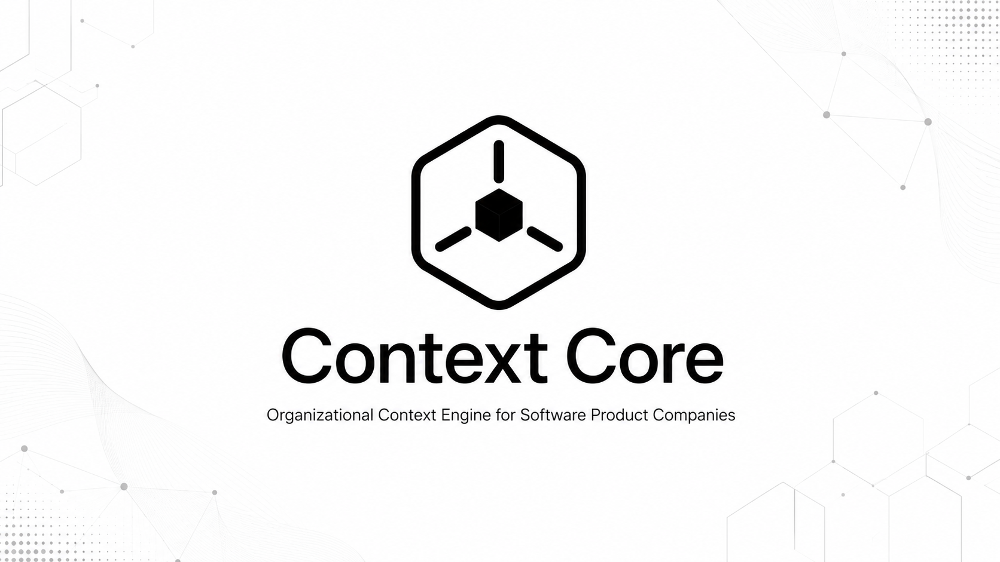
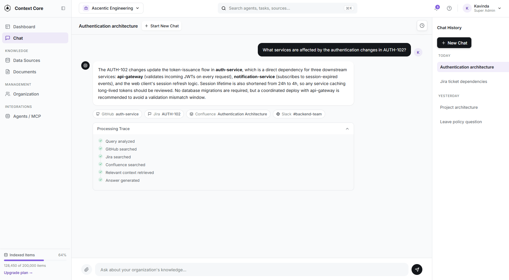
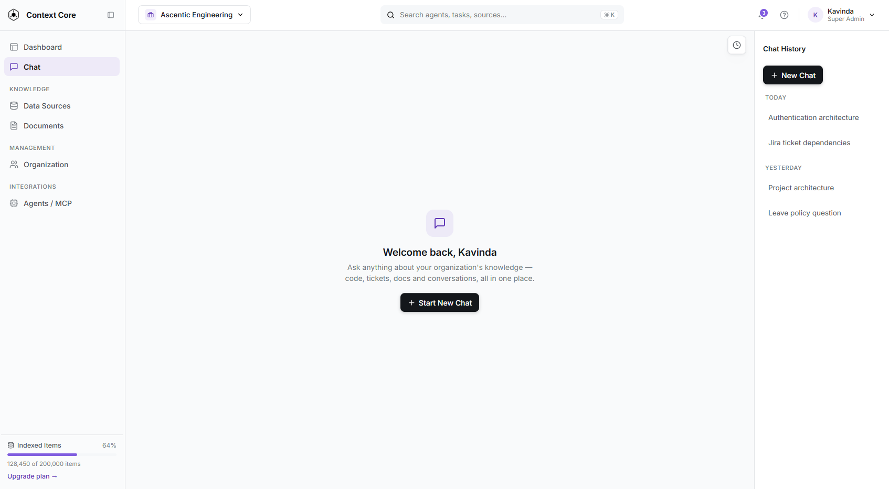
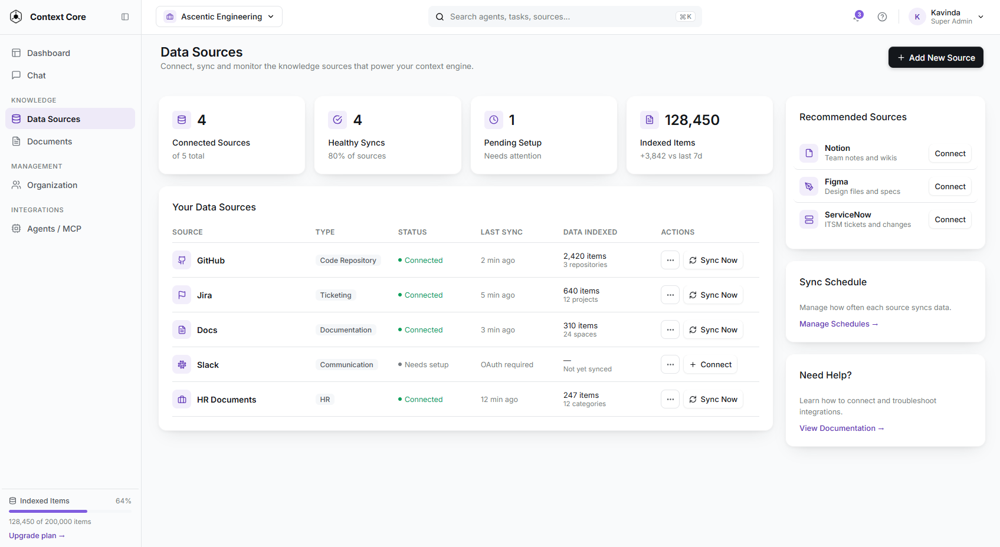
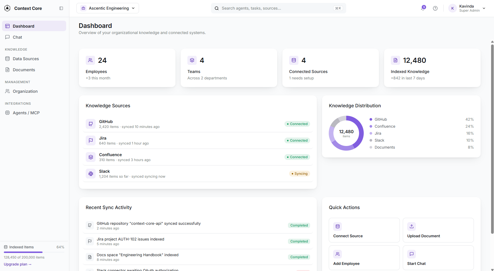
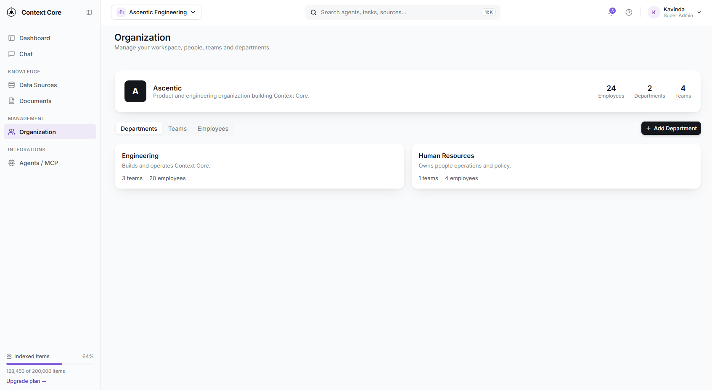
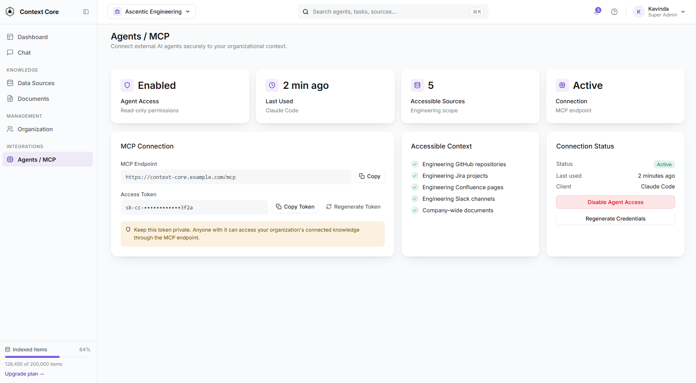

<p align="center">
  
</p>

<h1 align="center">Context Core</h1>

<p align="center">
  <strong>Organizational Context Engine for Software Product Companies</strong>
</p>

<p align="center">
  
  
  
  
  <a href="https://github.com/foverokavindz/context-core-client"></a>
</p>

---

## Overview

Context Core connects repositories, tickets, documentation, discussions, internal policies and
organizational knowledge into a single **role-aware context layer**. New and existing engineers use
it to understand projects, requirements, architecture, historical decisions and change impact
through evidence-backed answers — with citations, scoped to what their role is actually allowed to
see.

HR controls and maintains the authoritative documents. AI agents reach the same engine through MCP
or REST and receive a compact, task-specific context package, eliminating the repeated work of
searching, ranking, validating and synthesizing information across multiple systems.

**This is not** a typical chatbot, enterprise search, document RAG, or a coding assistant.

This repository is the **web client**. The ingestion and retrieval engine lives in
[context-core-api](https://github.com/foverokavindz/context-core-api).

---

## The Problem

> **Knowledge exists. Context does not.**

Software product companies generate knowledge continuously — across code, documents, tickets, chats,
emails and databases. And it isn't only engineering: HR, marketing, R&D, customer feedback,
operational records and internal meetings all produce it too. The *connections* between all of it
live only in the experience of individual employees.

That knowledge is scattered across systems, constantly changing, and disconnected. Requirements,
implementations, reasoning and decisions each live somewhere different, and nothing records the link
between them — so people rebuild that connection by hand, before every task. AI adoption makes this
worse rather than better: an agent handed access to your tools still has to search every system,
retrieve far too much, judge relevance, re-rank, filter and compress. It pays the same cost as a
person — in tool calls, latency and tokens — on every single run.

**Knowledge is generated → it fragments → people rebuild context, repeatedly → time, knowledge and
decision quality are lost → AI multiplies the cost.**

The symptoms: scattered knowledge · repeated effort · frequent interruptions to seniors ·
dependency on experienced employees · slow onboarding · reduced productivity · poor AI context.

---

## What the Business Actually Gets

| Value | What it means |
| --- | --- |
| **Faster onboarding** | New engineers explore architecture, decisions and ownership on their own — without waiting on someone senior. |
| **Fewer expert interruptions** | Tribal knowledge becomes self-serve, so routine questions stop reaching your most experienced people. |
| **A unified understanding** | Doesn't replace GitHub, Jira, Slack or Confluence — it acts as a supportive context layer above them. |
| **Less context-gathering time** | Instead of manually combining information, users get connected, evidence-backed answers with citations. |
| **Role-specific AI assistance** | Context is served according to the user's role and the privileges they actually hold. |
| **Supports curiosity** | Engineers can dive deep into the product to build domain knowledge, with fewer senior interruptions. |
| **Continuously refreshed context** | Sources synchronize through scheduled ingestion runs and webhook triggers. |
| **Reduced agent token usage** | A compact, task-specific package replaces the repeated work of searching, ranking, validating and synthesizing. |
| **Foundation for org intelligence** | Connecting engineering, HR and business systems into one layer becomes something leadership can eventually query. |

---

## Core Features

- **Workspace, Departments, Teams & Roles** — teams, projects, users and access scopes; the boundary every query is evaluated against, giving permission-aware answers.
- **Core Ingestion** — repository import (or live GitHub), ticket import, Markdown/text/PDF upload and HR docs, with job tracking, retries and re-indexing.
- **Traceability** — every piece of content carries source type, owner, location, version, authority, update date, access scope and processing state.
- **Indexing** — embeddings via pgvector, keyword/full-text search, metadata filters and incremental handling of unchanged content.
- **Hybrid Retrieval** — keyword + vector + metadata + optional relationship expansion, with merge, dedupe and ranking.
- **Project & Component Understanding** — onboarding and feature explanations that connect code with non-code evidence (docs, tickets, decisions).
- **Ticket Context Package** ⭐ — *the core differentiator*: a structured package per ticket covering requirements, code, decisions, dependencies, risks, tests and ownership.
- **Agent REST API / MCP Connection** — connect an agent from an IDE or anywhere: scoped agent identity and key, task input, token budget, structured JSON output and request logging.
- **HR Document Management** — upload, approval and currentness tracking, visibility control, versioning and re-index.
- **Evaluation & Observability** — retrieval, citation and permission metrics, plus traces, latency and token logs.

---

## Feature Status

Honest state of this client today:

| Area | Status | Where it lives |
| --- | --- | --- |
| Chat with your data sources | ✅ **Shipped** | `src/features/chat/`, `src/services/Chat.service.ts` |
| Ingest external data sources | ✅ **Shipped** — updates on the way | `src/features/datasources/`, `src/services/DataSource.service.ts` |
| Dashboard | 🚧 Coming soon | `src/pages/Dashboard.tsx` |
| Document portal | 🚧 Coming soon | `src/pages/Documents.tsx` |
| Organization — roles, departments, teams | 🚧 Coming soon | `src/pages/Organization.tsx` |
| Agent MCP connection | 🚧 Coming soon | `src/pages/AgentsMcp.tsx` |

---

## Demo & Screens

| | |
| --- | --- |
| 🎬 **Product demonstration** | [context-core-demo.mp4](public/assets/videos/context-core-demo.mp4) *(~50 MB)* |
| 🎬 **Prototype walkthrough** | [prototype-walkthrough.mp4](public/assets/videos/prototype-walkthrough.mp4) |
| 🎨 **Interactive prototype** | [View the prototype](https://claude.ai/code/artifact/829d399d-8f59-4a43-9266-b38ff53aebd6) |

> **Note:** some screens below are design prototypes for features listed as *coming soon* in the
> status table above — they are not all live in the running app yet.

| Chat | Start a new chat |
| --- | --- |
|  |  |

| Data Sources | Dashboard |
| --- | --- |
|  |  |

| Organization management | Configure Agent / MCP |
| --- | --- |
|  |  |

---

## Architecture

The client uses **feature-wise separation, not layer-wise**. A feature owns its screens, state,
types and mappers in one place, and shared infrastructure sits around it.

| Responsibility | Where | What goes there |
| --- | --- | --- |
| **Routing surface** | `src/pages/` | Thin route wrappers with no logic — each page composes one feature panel. |
| **Feature slices** | `src/features/<feature>/` | Vertical slices (`chat`, `datasources`). Each holds `panels/` (stateful composition root), `screens/` (top-level views per mode), `sections/` (the pieces a screen is built from), `widgets/`, `context/` (feature-local React context) and its own `*.types.ts` / `*.mappers.ts`. |
| **Shared UI** | `src/components/` | Cross-feature presentational components, each with a co-located `*.styled.component.tsx`. |
| **Shell & navigation** | `src/layouts/`, `src/router/`, `src/configs/` | `MainLayout` takes `sidebar`/`topBar` as props and renders routes through `<Outlet />`. Adding a route means touching a page, `Router.tsx` and `Navigation.configs.tsx` together. |
| **Transport** | `src/api/`, `src/services/` | An `IApiClient` interface, an `AxiosClient` singleton, and one service class per entity. All calls return an `ApiResponse<T>` envelope and **never throw to components** — components branch on `response.success`. |
| **Design system** | `src/theme/theme.ts` | MUI theme extended with a `theme.tokens.*` namespace (surface levels, radius scale, dual-shadow elevation, motion). Styling values come from tokens, never hardcoded. |
| **Shared contracts** | `src/types/` | Cross-feature types. Feature-local types stay inside the feature. |

---

## Tech Stack

| Layer | Technology |
| --- | --- |
| UI framework | React 19 |
| Language | TypeScript 6 (`verbatimModuleSyntax`) |
| Build tool | Vite 8 |
| Components & theming | Material UI 9 + Emotion |
| Routing | React Router 7 |
| HTTP | Axios, wrapped by `src/api/` |
| Icons | lucide-react |
| Markdown rendering | react-markdown + remark-gfm |
| Linting | Oxlint |
| Backend | [context-core-api](https://github.com/foverokavindz/context-core-api) — Python, PostgreSQL + pgvector |

---

## Getting Started

### Prerequisites

- **Node.js `^20.19.0 || >=22.12.0`** (Vite 8's engine range — note Node 21 is not supported) and npm
- A running **Context Core API** — see [context-core-api](https://github.com/foverokavindz/context-core-api) for its setup (Python, PostgreSQL with the pgvector extension, and LLM provider keys)

### Install and run

```bash
git clone https://github.com/foverokavindz/context-core-client.git
cd context-core-client
npm install
cp .env.example .env    # then edit if your API isn't on localhost:8000
npm run dev
```

The dev server prints a local URL; the app redirects `/` to `/dashboard`.

### Environment variables

| Variable | Default | Purpose |
| --- | --- | --- |
| `VITE_API_BASE_URL` | `http://localhost:8000/api` | Base URL of the Context Core API. Read in `src/configs/api.configs.ts`. |

### Scripts

| Command | What it does |
| --- | --- |
| `npm run dev` | Start the Vite dev server with HMR |
| `npm run build` | Type-check (`tsc -b`) then build for production |
| `npm run lint` | Run Oxlint |
| `npm run preview` | Serve the production build locally |

> There is **no automated test script yet** — testing to date has been manual and
> scenario-based (see [Evaluation](#evaluation)).

---

## Usage Walkthrough

**Asking a question.** The chat feature opens a session, then sends queries against it:

```http
POST /v1/chats                        → creates a chat session
POST /v1/chats/{chatSessionId}/query  → returns the answer
GET  /v1/users/{userId}/chats         → chat history for the sidebar
```

The query response carries more than prose: the answer body is rendered as Markdown, the
**citations** are listed alongside it (`Citations.section.tsx`), and the **retrieval trace** — what
was searched and what came back — is expandable in the UI (`RetrievalTrace.section.tsx`). That
trace is deliberately visible: an answer you can't verify isn't much better than a guess.

**Connecting a source.** Ingestion starts a background run you then poll for pipeline status:

```http
POST /v1/ingestData/{sourceSlug}       → starts an ingestion run
GET  /v1/dataSources/{id}/syncRuns     → pipeline stage status
GET  /v1/dataSources/{id}/resources    → what got indexed
GET  /v1/dataSources?team_id={teamId}  → connected sources
```

> **Known limitation:** there is no authentication yet. The demo user, team and department IDs are
> hardcoded in `src/configs/user.configs.ts`, which is what permission scoping is currently
> evaluated against.

---

## Roadmap

### 1 — Planned to improve next

- Implement document ingestion
- Add more stages to show pipeline status
- Prevent content duplication on re-ingestion
- Implement Dashboard, agent MCP connection and Organization setup
- Implement reranking, merge and guardrails
- Idempotency checks for ingestion requests

### 2 — Features to be added

- Scheduled knowledge refresh
- Observability support
- MCP wrapper over the proven REST endpoints
- Answer caching
- Deeper reasoning capabilities
- Tools that give agents more capability
- Feedback-based optimization

### 3 — Required before real-world use

- Multi-tenant support
- Microsoft AD integration for workspaces
- More external connectors for broader compatibility
- Improved performance, accuracy, token efficiency and robustness

---

## How AI Helped Build This

- **Research partner** — Perplexity / ChatGPT / Claude / Gemini: deep research and brainstorming, identifying multiple possible scenarios and viewing the problem from perspectives that would have been hard to reach alone inside a hackathon timeline.
- **Planner** — ChatGPT: MoSCoW scoping, a four-week plan, engineering scenarios and acceptance criteria, risks and trade-offs, epics and user stories.
- **Learning and AI engineering** — ChatGPT / Claude: technical mentor while learning and implementing unfamiliar AI-engineering concepts.
- **Realistic test data** — Codex: generating the realistic organizational dataset needed to test Context Core.
- **UI, branding and product design** — Lovable / Claude Design: exploring design iterations and prototyping core screens before spending development time on frontend implementation.
- **Implementation & testing** — Claude Code / Codex + sub-agents: a spec-driven workflow — give the spec with objective, acceptance criteria and use cases, require a plan before any code.

---

## Evaluation

**A controlled environment, not a live company.** A full dummy project (TrackIT) was built from
scratch — code repos, epics, tickets, Confluence docs and simulated Slack threads — written around
consistent feature scenarios, so every retrieval result had a known-correct answer to check against.

**Persona-based scenario testing.** Evaluation scenarios were written for two personas — a new
joiner and an existing engineer — then queried manually and read end to end.

**Stage-by-stage pipeline inspection.** Every ingestion run writes a full JSON snapshot per source,
used to eyeball real chunk content and metadata before trusting it. Each source — GitHub, Jira,
Confluence, Slack — has dedicated tests per pipeline stage, followed by a full end-to-end pass.

**Connector and permission checks, done by hand.** Real external connections (GitHub, Jira,
Confluence, Slack) were verified manually, and permission-scoped retrieval was confirmed to behave
correctly across roles.

### What's not measured yet

No formal ranking, precision/recall scoring, token-usage tracking or cost calculation — that's the
honest gap. Time went into getting ingestion and retrieval solid end-to-end and shipping a working
frontend, over building an automated eval harness.

---

## Challenges & Honest Limitations

- **Code chunking & language support** — splitting code files while preserving syntactic structure needs language-aware parsing. Only TypeScript is supported today, through a language-support library.
- **Four separate connector integrations** — GitHub, Jira, Confluence and Slack each have different APIs, auth models and data shapes. Each had to be understood, connected and fitted into a common ingestion contract.
- **Learning while building** — the ingestion and retrieval pipeline was implemented while simultaneously learning the underlying AI concepts and tooling, within a month.
- **Simulated dataset instead of a real project** — a dummy dataset (TrackIT) was used rather than integrating a real-world project, to keep cross-source complexity manageable within MVP scope.
- **Onboarding a new source isn't plug-and-play** — every additional source needs its own configuration, auth, field mapping and chunking rules before it fits the shared pipeline.
- **LLM budget constraints** — development and testing ran on smaller, cheaper models rather than frontier models due to credit limits; a constraint on iteration speed and eval quality, not just cost.
- **Token-efficient pipeline engineering** — every stage was deliberately engineered to minimize token spend: batching embeddings, and keeping permission filtering, exact-ID lookup and merging entirely deterministic and off the LLM, calling the model only for synthesis. This is what makes the product's own token-saving claim real.

---

## Related Repositories

| Repository | Description |
| --- | --- |
| [context-core-api](https://github.com/foverokavindz/context-core-api) | Backend — ingestion pipeline, hybrid retrieval, and the REST API this client consumes |
